  

    

  # Muhammad Fouz Khan

  

    
  

  ### 🚀 Building AI Tools & Shipping Products

  **AI Engineer • Python Developer • Video Editor • Creator**

   

  
  &nbsp;
  
  &nbsp;
  
  &nbsp;
  

---

### 👨‍💻 About Me

I'm an **AI Engineer** who prefers shipping products over just writing code. I build autonomous agents, automation tools, and AI-powered products that solve real problems.

* 🤖 **Currently:** Building **Ultron Downloader v5.x** — a self-healing multi-platform download engine (Python + PySide6).
* 🧠 **AI Focus:** Fascinated by **LLM Agents**, RAG pipelines, and making AI actually useful in production.
* 🎬 **Creator:** Running **Anatomy Architect** — an AI-powered educational YouTube channel with automated production.
* 🎓 **Studying:** BS Artificial Intelligence @ University of Layyah (2025–2029).
* 🤝 **Open to:** Collaborations, internships, and ambitious AI ideas.

---

### 📡 Technical Capability & Skills Radar

  

---

### 🛠️ Core Tooling & Technologies

| **Category** | **Technologies** |
| :--- | :--- |
| **AI & Python** |  |
| **Web Development** |  |
| **Tools & Platforms** |  |
| **Creative** |  |

---

### ⚡ Engineering Showcase & Performance

  

---

### 📊 GitHub Activity

  
  

  

---

### 🎮 The Human Side

I'm not just a code machine. When the IDE closes, here is who I am:

* **📚 Current Obsession:** Wrote a **200-page Arch Linux guide** for a friend — in one night, as a gift.
* **🎬 Creating:** Editing trending videos and building an educational YouTube empire.
* **🤖 Philosophy:** I believe in using AI to **amplify** human capability, not replace creativity.
* **⚡ Motto:** *Ship fast. Break things. Learn faster.*

---

### 📜 Certifications

`Anthropic` Claude Code in Action &nbsp;•&nbsp; `Anthropic` AI Fluency &nbsp;•&nbsp; `Saylor` Python CS105 (96.84%) &nbsp;•&nbsp; `Google` Cybersecurity &nbsp;•&nbsp; Video Editing &nbsp;•&nbsp; Soft Skills

---

  Let's build something incredible together. 🚀

